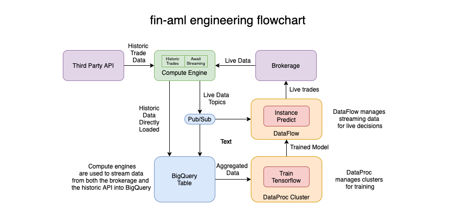

# Financial Advanced Machine Learning

Repository to govern the fin-aml project in live mode. Machine learning ideas in this repository are based on ideas in the book, "Advances in Financial Machine Learning", by Macros Lopez de Prado.

The project is divided into 4 sections:

#### Historic Trades

Handles the job of querying Polygon.io (third party API) for historic trade information and loading it into the BigQuery table.

Runs a simple script that iteratively queries the API, collates a csv, and loads the csv to BigQuery directly.

Tools: RESTful API, SQL, BqPivot ("Flash Pivot"), Python, GCloud

#### Train Tensorflow

ETL BigQuery Data and Train a TensorFlow model using DataProc with Dask and TensorFlow.

Tools: DataProc distributed clusters (HaDoop), Dask, TensorFlow

#### Await Streaming

Async Await streaming data from TDA API and stream it into the BigQuery Table.

Tools: Websockets (Python Asyncio), GCloud

#### Instance Predict

Load's a previously trained model, queries the newest information and makes predictions. Sends live trade requests to TDA. 

Tools: DataFlow (Apache Beam), Pandas, Python

